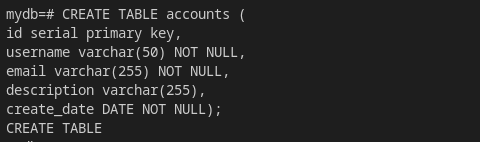
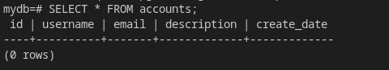
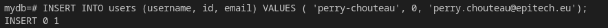
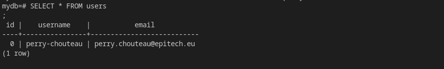

## Prérequis 📝

-   Avoir `docker` et `docker-compose` installés sur votre ordinateur
-   Avoir une connaissance de base de SQL

## Etape 2 : Créer un fichier `docker-compose.yml` 2️⃣

Dans le répertoire de votre workshop, créez un fichier `docker-compose.yml` avec le contenu suivant :

```yml
version: '3'

services:
  db:
    container_name: ws-db
    image: postgres
    environment:
      POSTGRES_USER: myuser
      POSTGRES_PASSWORD: mypassword
      POSTGRES_DB: mydb
    ports:
      - "6000:5432"
    volumes:
      - pgdata:/var/lib/postgresql/data

volumes:
  pgdata:
```

## Etape 3 : Lancer la base de données 3️⃣

Utilisez la commande suivante pour lancer la base de données :

`docker-compose up -d`

Cela lancera le service `db` défini dans le fichier `docker-compose.yml`.

## Etape 4 : Se connecter à la base de données 4️⃣

Vous pouvez maintenant vous connecter à la base de données en utilisant un client SQL tel que `psql`. Utilisez la commande suivante pour vous connecter :

```sh
$> psql -h localhost -U myuser -d mydb --port=6000
```

## Etape 5 : Exercices 5️⃣

1.  Créez une table nommée "users" avec les colonnes "id", "username" et "email".


s


2.  Insérez des données dans la table "users".



3.  Sélectionnez tous les utilisateurs de la table "users".



4.  Mettez à jour l'email d'un utilisateur en utilisant son nom d'utilisateur.


5.  Supprimez un utilisateur en utilisant son nom d'utilisateur.

